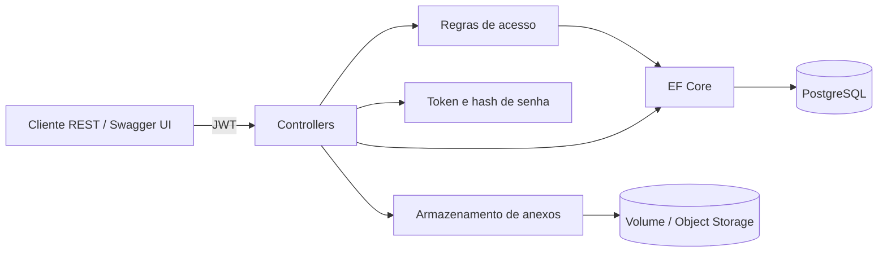
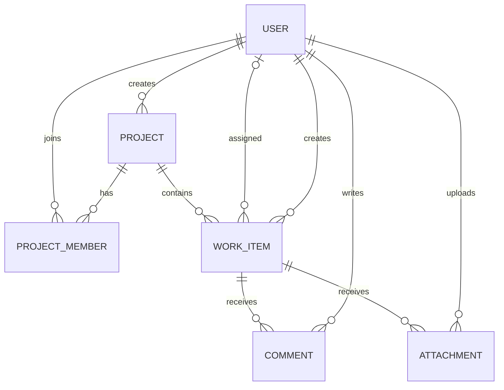

# ProjectFlow API

[](https://github.com/FredericoFahndrich/projectflow-api/actions/workflows/ci.yml)
[](https://dotnet.microsoft.com/)
[](https://www.postgresql.org/)
[](LICENSE)

Backend REST de gerenciamento colaborativo de projetos e chamados. O projeto demonstra um fluxo completo de engenharia de backend: autenticação, autorização em dois níveis, persistência relacional, uploads seguros, migrações, documentação executável, testes com PostgreSQL real e entrega conteinerizada.

## O que o projeto entrega

- Cadastro e login com JWT assinado e senhas protegidas pelo `PasswordHasher` do ASP.NET Core.
- Perfis globais (`Member` e `Admin`) e permissões por projeto (`Viewer`, `Contributor`, `Manager`, `Owner`).
- CRUD de projetos e tarefas, atribuição de responsáveis, prioridades, prazos e fluxo de status.
- Membros de projeto, comentários e anexos com limite de tamanho, extensões permitidas e nomes físicos não previsíveis.
- PostgreSQL com Entity Framework Core, relacionamentos, índices, constraints e migration inicial.
- API REST documentada em OpenAPI 3.1 com Swagger UI e autenticação Bearer interativa.
- Testes unitários e testes de integração end-to-end com `WebApplicationFactory` + PostgreSQL efêmero via Testcontainers.
- Docker multi-stage, usuário não-root, Docker Compose, health endpoint e pipeline de CI.

## Arquitetura



O código usa uma arquitetura modular simples dentro de uma única aplicação. Para o tamanho atual, isso mantém o fluxo fácil de navegar sem introduzir camadas artificiais; `Contracts`, `Domain`, `Data`, `Infrastructure` e `Controllers` deixam claras as fronteiras que podem virar projetos separados quando a solução crescer.

## Modelo de autorização

| Ação | Viewer | Contributor | Manager | Owner | Admin |
|---|:---:|:---:|:---:|:---:|:---:|
| Ler projeto e tarefas | ✓ | ✓ | ✓ | ✓ | ✓ |
| Criar/editar tarefa e comentar |  | ✓ | ✓ | ✓ | ✓ |
| Gerenciar membros |  |  | ✓ | ✓ | ✓ |
| Excluir tarefa/projeto |  |  | ✓ | ✓ | ✓ |
| Gerenciar papéis globais |  |  |  |  | ✓ |

As verificações vivem em `ProjectAccessService`, evitando espalhar comparações de papéis pelos controllers. Um administrador global pode operar qualquer projeto; os demais usuários precisam ser membros.

## Modelo de dados



## Executar com Docker

Pré-requisito: Docker com Compose.

```bash
cp .env.example .env
# edite as credenciais e o JWT_SECRET
docker compose up --build
```

Depois da inicialização:

- Swagger UI: `http://localhost:8080/docs`
- OpenAPI JSON: `http://localhost:8080/swagger/v1/swagger.json`
- Health check: `http://localhost:8080/health`

O Compose cria um administrador de bootstrap usando `BOOTSTRAP_ADMIN_EMAIL` e `BOOTSTRAP_ADMIN_PASSWORD`. A aplicação só cria esse usuário quando as duas variáveis existem e o e-mail ainda não está cadastrado.

## Fluxo rápido da API

1. Registre um usuário em `POST /api/auth/register` ou faça login em `POST /api/auth/login`.
2. Copie `accessToken`, abra **Authorize** no Swagger e cole somente o token.
3. Crie um projeto em `POST /api/projects` — o criador se torna `Owner` automaticamente.
4. Adicione membros e crie tarefas, comentários e anexos.

```bash
curl -X POST http://localhost:8080/api/auth/register \
  -H "Content-Type: application/json" \
  -d '{"name":"Ada Lovelace","email":"ada@example.com","password":"StrongPass123!"}'
```

Um arquivo pronto para o REST Client também está disponível em [`ProjectFlow.Api.http`](src/ProjectFlow.Api/ProjectFlow.Api.http).

## Endpoints principais

| Método | Rota | Descrição |
|---|---|---|
| `POST` | `/api/auth/register` | Cadastra usuário e retorna JWT |
| `POST` | `/api/auth/login` | Autentica e retorna JWT |
| `GET/PATCH` | `/api/users` | Lista usuários e altera papel global (Admin) |
| `GET/POST/PUT/DELETE` | `/api/projects` | Gerencia projetos |
| `POST/DELETE` | `/api/projects/{id}/members` | Gerencia membros |
| `GET/POST` | `/api/projects/{id}/work-items` | Lista e cria tarefas |
| `GET/PUT/DELETE` | `/api/work-items/{id}` | Consulta e altera tarefa |
| `GET/POST/DELETE` | `/api/work-items/{id}/comments` | Gerencia comentários |
| `POST/GET/DELETE` | `/api/work-items/{id}/attachments` | Envia, baixa e remove anexos |

O Swagger é a referência completa e mantém contratos, modelos e códigos de resposta sincronizados com o código.

## Testes

```bash
dotnet restore ProjectFlow.sln
dotnet test ProjectFlow.sln --configuration Release --collect:"XPlat Code Coverage"
```

Os testes unitários exercitam emissão de tokens e regras de permissão. O teste de integração sobe um PostgreSQL real em container e percorre cadastro → projeto → tarefa → comentário através de HTTP, além de verificar rejeição de acesso anônimo.

## Decisões de segurança

- O segredo JWT é validado no startup e deve ter no mínimo 32 caracteres.
- Tokens têm emissor, audiência, expiração, assinatura HMAC-SHA256 e clock skew curto.
- E-mails e chaves de projeto são normalizados e protegidos por índices únicos.
- Nomes originais de anexos nunca são usados como caminho físico; o backend gera identificadores UUIDv7.
- Extensão e tamanho são validados, e o container executa como usuário não-root.
- Erros usam `ProblemDetails`; credenciais reais e conteúdo de upload ficam fora do Git.

Para produção, o próximo passo seria mover anexos para S3/Azure Blob, usar um provedor OIDC, aplicar rate limiting, observabilidade OpenTelemetry e varredura antimalware.

## Estrutura

```text
src/ProjectFlow.Api/
├── Contracts/       # DTOs e mapeamentos da API
├── Controllers/     # Endpoints REST
├── Data/            # DbContext, migration e bootstrap
├── Domain/          # Entidades e enums
└── Infrastructure/  # JWT, autorização e arquivos
tests/ProjectFlow.Api.Tests/
├── Unit/
└── Integration/
```

## Licença

Distribuído sob a licença [MIT](LICENSE).

